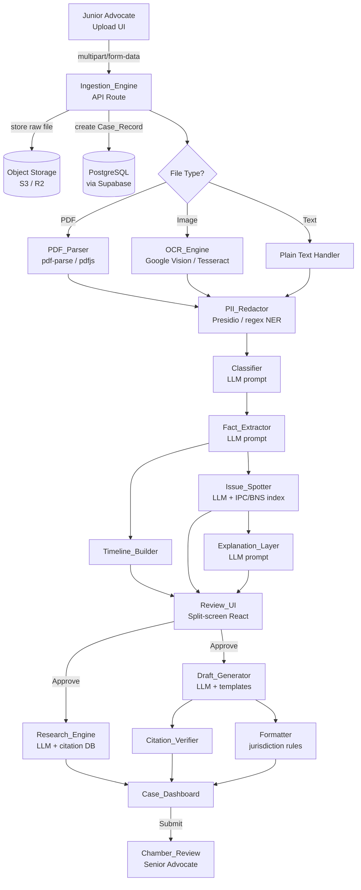
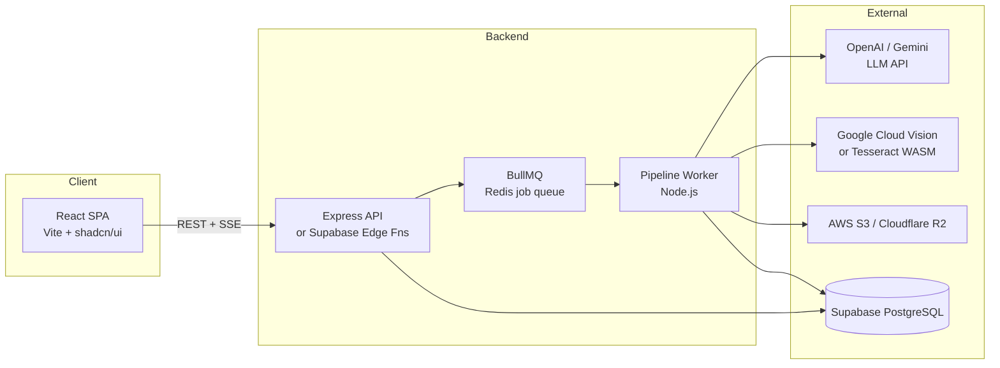

# Design Document: Legal Luminaire Omni-Modal Ingestion

## Overview

The Omni-Modal Ingestion feature transforms Legal Luminaire into a document-first case management system. A Junior Advocate uploads raw legal artifacts (PDFs, smartphone photos, handwritten panchnamas, plain text) through a single drag-and-drop interface. The system then runs a sequential pipeline: file storage → parse/OCR → PII redaction → classification → fact extraction → issue spotting → human review → draft generation → chamber review. The result is a fully structured, court-ready digital case file with zero manual transcription.

The feature is built on the existing React 19 + TypeScript + Vite frontend, with Supabase providing PostgreSQL persistence, authentication, and object storage. A Node.js/Express API layer (deployed as Supabase Edge Functions or a separate Express server) orchestrates the AI pipeline stages. All LLM calls are routed through a server-side proxy to keep API keys off the client and to enforce PII redaction before any external transmission.

---

## Architecture

### High-Level Pipeline



### Deployment Topology



**Design Decision — Job Queue**: The ingestion pipeline is long-running (up to 5 minutes for a 500-page PDF). Rather than holding an HTTP connection open, the API enqueues a job and returns a `job_id` immediately. The frontend polls or subscribes via Server-Sent Events (SSE) for stage-level progress updates. BullMQ on Redis is the queue implementation; it supports retries, concurrency limits, and per-stage progress events natively.

---

## Components and Interfaces

### 1. Ingestion_Engine (API)

**Route**: `POST /api/cases` — creates a Case_Record and enqueues ingestion jobs for each uploaded file.

```typescript
// Request (multipart/form-data)
interface CreateCaseRequest {
  title: string;
  caseType: string;
  jurisdiction: string;
  advocateId: string;
  files: File[]; // 1–20 files, each ≤ 100 MB
}

// Response
interface CreateCaseResponse {
  caseId: string;
  jobIds: string[]; // one per file
  status: "queued";
}
```

**Route**: `GET /api/cases/:caseId` — retrieves a Case_Record.

**Route**: `GET /api/cases/:caseId/progress` — SSE stream emitting `PipelineProgressEvent` per file per stage.

```typescript
interface PipelineProgressEvent {
  fileId: string;
  fileName: string;
  stage: "uploading" | "parsing" | "ocr" | "classifying" | "extracting" | "issue-spotting" | "complete" | "error";
  progress: number; // 0–100
  message?: string;
}
```

### 2. PDF_Parser

Wraps `pdf-parse` (Node.js). Splits documents > 50 pages into chunks before returning.

```typescript
interface PDFParseResult {
  text: string;
  pageCount: number;
  chunks: Array<{ startPage: number; endPage: number; text: string }>;
}
```

### 3. OCR_Engine

Calls Google Cloud Vision API (primary) with Tesseract WASM as fallback for offline/cost scenarios. Returns per-page results.

```typescript
interface OCRResult {
  text: string;
  detectedLanguage: "en" | "hi" | "gu" | "unknown";
  confidenceScore: number; // 0.0–1.0
  lowConfidencePages: number[]; // page indices with score < 0.6
}
```

### 4. PII_Redactor

Uses Microsoft Presidio (Python microservice) or a TypeScript NER regex layer for: full names, Aadhaar numbers (12-digit), phone numbers, email addresses, physical addresses.

```typescript
interface RedactionResult {
  redactedText: string;
  // mapping stored encrypted in DB, never returned to client
  entityCount: Record<"NAME" | "AADHAAR" | "PHONE" | "EMAIL" | "ADDRESS", number>;
}
```

### 5. Classifier

LLM prompt-based classification. Returns one of the defined document types plus a confidence score.

```typescript
type DocumentType =
  | "FIR" | "Bail_Order" | "NDPS_Seizure_Memo"
  | "Civil_Contract" | "Charge_Sheet" | "Court_Order" | "Unknown";

interface ClassificationResult {
  documentType: DocumentType;
  confidence: number; // 0.0–1.0
  requiresManualConfirmation: boolean; // true if confidence < 0.75
}
```

### 6. Fact_Extractor + Timeline_Builder

```typescript
interface ExtractedFacts {
  incidentType: string | null;
  evidenceType: string | null;
  jurisdiction: string | null;
  accusedCount: number | null;
  complainantType: string | null;
  applicableSections: string[];
  timelineEvents: Array<{ date: string; description: string }>;
  missingFields: string[]; // fields that could not be determined
}
```

### 7. Issue_Spotter

Cross-references extracted facts against a local IPC/BNS section index (JSON lookup table). Checks panchnama/NDPS documents for witness signature presence.

```typescript
interface DefectRecord {
  defectType: string;
  sourceDocumentName: string;
  violatedClause: string;
  explanation?: string; // populated by Explanation_Layer
  precedentCitation?: string;
}
```

### 8. Review_UI

React component using `react-resizable-panels` (already in dependencies) for the split-screen layout. Left panel renders the original document (PDF.js viewer or ``). Right panel renders editable fields, timeline, and defect list.

```typescript
interface ReviewUIProps {
  caseId: string;
  documents: ReviewDocument[];
  onApprove: (caseId: string) => void;
}
```

### 9. Draft_Generator + Citation_Verifier + Formatter

```typescript
interface DraftRequest {
  caseId: string;
  draftType: "Section439BailApplication" | "WrittenStatement" | "Vakalatnama";
}

interface DraftResult {
  draftId: string;
  version: number;
  content: string; // raw text / markdown
  unverifiedCitations: string[];
  citationVerified: boolean;
  formattedContent: string; // after Formatter applies jurisdiction rules
}
```

### 10. Chamber_Review

Role-based workflow. Senior_Advocate receives a notification (Supabase Realtime or email via Resend). Actions: Approve → status `"Approved"`, Reject → status `"Returned"` with comments.

---

## Data Models

### Case_Record (PostgreSQL via Drizzle ORM)

```typescript
// drizzle schema
export const cases = pgTable("cases", {
  id:              uuid("id").primaryKey().defaultRandom(),
  title:           text("title").notNull(),
  caseType:        text("case_type").notNull(),
  jurisdiction:    text("jurisdiction").notNull(),
  advocateId:      uuid("advocate_id").notNull(),
  status:          text("status").notNull().default("draft"),
  // status: draft | in_review | pending_chamber | approved | returned
  createdAt:       timestamp("created_at").defaultNow(),
  updatedAt:       timestamp("updated_at").defaultNow(),
  approvedAt:      timestamp("approved_at"),
  approvedBy:      uuid("approved_by"),
  seniorComments:  text("senior_comments"),
});
```

### Case_Document

```typescript
export const caseDocuments = pgTable("case_documents", {
  id:              uuid("id").primaryKey().defaultRandom(),
  caseId:          uuid("case_id").notNull().references(() => cases.id),
  fileName:        text("file_name").notNull(),
  storageUrl:      text("storage_url").notNull(),
  fileType:        text("file_type").notNull(), // pdf | image | text
  documentType:    text("document_type"),       // Classifier output
  classConfidence: real("class_confidence"),
  extractedText:   text("extracted_text"),
  ocrConfidence:   real("ocr_confidence"),
  flaggedForReview:boolean("flagged_for_review").default(false),
  manuallyVerified:boolean("manually_verified").default(false),
  createdAt:       timestamp("created_at").defaultNow(),
});
```

### Extracted_Facts

```typescript
export const extractedFacts = pgTable("extracted_facts", {
  id:               uuid("id").primaryKey().defaultRandom(),
  caseId:           uuid("case_id").notNull().references(() => cases.id),
  incidentType:     text("incident_type"),
  evidenceType:     text("evidence_type"),
  jurisdiction:     text("jurisdiction"),
  accusedCount:     integer("accused_count"),
  complainantType:  text("complainant_type"),
  applicableSections: jsonb("applicable_sections").$type<string[]>().default([]),
  missingFields:    jsonb("missing_fields").$type<string[]>().default([]),
});
```

### Timeline_Event

```typescript
export const timelineEvents = pgTable("timeline_events", {
  id:          uuid("id").primaryKey().defaultRandom(),
  caseId:      uuid("case_id").notNull().references(() => cases.id),
  eventDate:   timestamp("event_date").notNull(),
  description: text("description").notNull(),
  sourceDocId: uuid("source_doc_id"),
});
```

### Defect_Record

```typescript
export const defectRecords = pgTable("defect_records", {
  id:               uuid("id").primaryKey().defaultRandom(),
  caseId:           uuid("case_id").notNull().references(() => cases.id),
  defectType:       text("defect_type").notNull(),
  sourceDocName:    text("source_doc_name").notNull(),
  violatedClause:   text("violated_clause").notNull(),
  explanation:      text("explanation"),
  precedentCitation:text("precedent_citation"),
});
```

### Draft

```typescript
export const drafts = pgTable("drafts", {
  id:               uuid("id").primaryKey().defaultRandom(),
  caseId:           uuid("case_id").notNull().references(() => cases.id),
  draftType:        text("draft_type").notNull(),
  version:          integer("version").notNull().default(1),
  content:          text("content").notNull(),
  formattedContent: text("formatted_content"),
  citationVerified: boolean("citation_verified").default(false),
  unverifiedCitations: jsonb("unverified_citations").$type<string[]>().default([]),
  createdAt:        timestamp("created_at").defaultNow(),
});
```

### PII_Mapping (encrypted)

```typescript
export const piiMappings = pgTable("pii_mappings", {
  id:          uuid("id").primaryKey().defaultRandom(),
  caseId:      uuid("case_id").notNull().references(() => cases.id),
  placeholder: text("placeholder").notNull(), // e.g. "[NAME_1]"
  entityType:  text("entity_type").notNull(),
  // encrypted_value stored as AES-256-GCM ciphertext
  encryptedValue: text("encrypted_value").notNull(),
});
```

### Audit_Log

```typescript
export const auditLog = pgTable("audit_log", {
  id:         uuid("id").primaryKey().defaultRandom(),
  caseId:     uuid("case_id").notNull().references(() => cases.id),
  actorId:    uuid("actor_id").notNull(),
  action:     text("action").notNull(),
  fromStatus: text("from_status"),
  toStatus:   text("to_status"),
  metadata:   jsonb("metadata"),
  createdAt:  timestamp("created_at").defaultNow(),
});
```

### User / Role

Supabase Auth handles authentication. A `profiles` table extends `auth.users` with a `role` column (`junior_advocate` | `senior_advocate`).

```typescript
export const profiles = pgTable("profiles", {
  id:             uuid("id").primaryKey(), // matches auth.users.id
  role:           text("role").notNull().default("junior_advocate"),
  tutorialMode:   boolean("tutorial_mode").default(true),
  assignedSenior: uuid("assigned_senior"),
});
```

---

